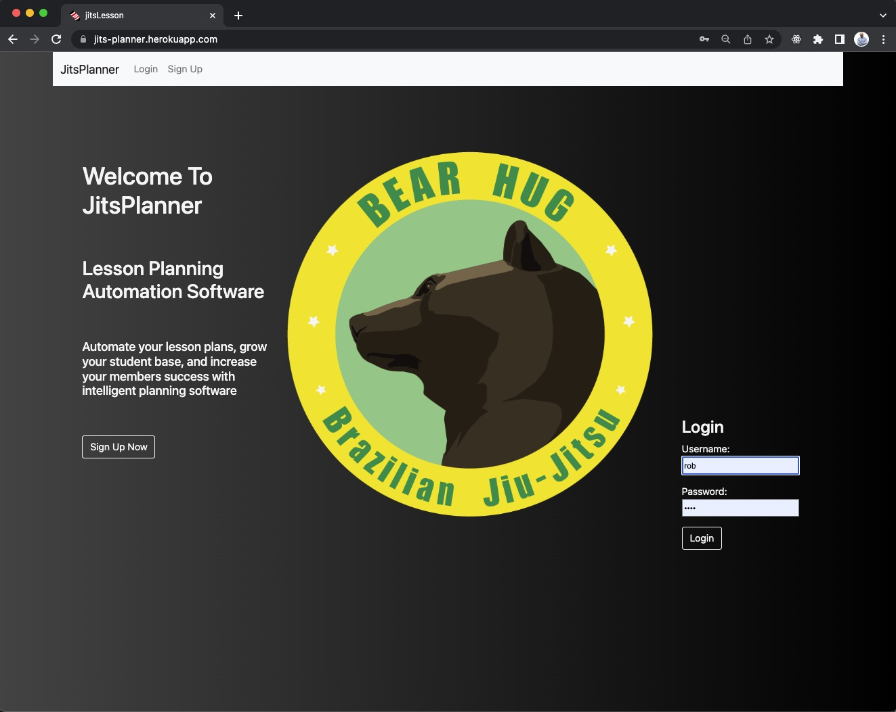
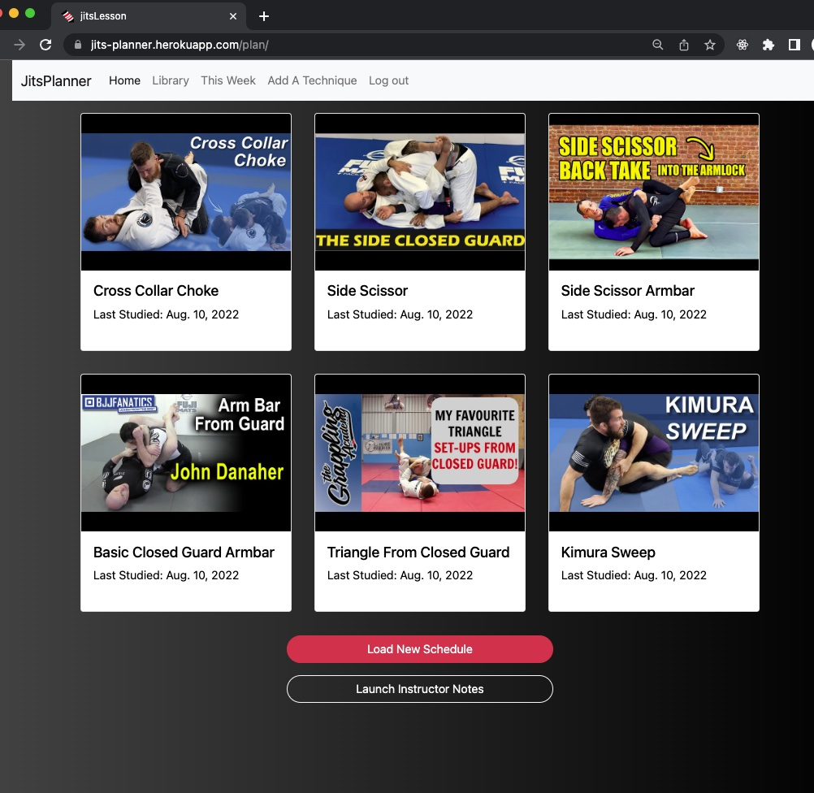
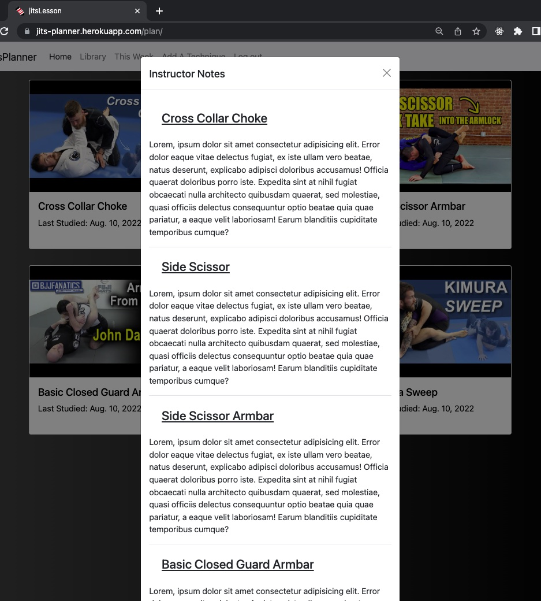

#JitsPlanner

## Getting Started

JitsPlanner is a lesson-plan automation app that generates weekly lesson plans from a library of topics. Each week, a new category is cycled through, and 6 techniques are loaded based on a queue. Optional youtube videos accompany each technique, and instructors are presented with an optional modal window with notes for quick reminders and key ideas while teaching.

[The Deployed Project] (https://jits-planner.herokuapp.com)

[Planning Materials](https://trello.com/b/KAMGRfV2/jitsplanner)

## Screenshots

 

## Technologies Used

- Django
- postgreSQL
- bootstrap
- HTML
- CSS
- Django-Embed-Video 

## Icebox

- [ ] restrict access to the lesson plan generation button
- [ ] Implement timed repetition algorythm similar to Anki flashcards
- [ ] Implement an email function that emails instructors the weekly lesson plan
- [ ] Create a student section that shows basic information about the weekly plan
- [ ] Create a calendar that shows previous and upcoming topics

## Credits